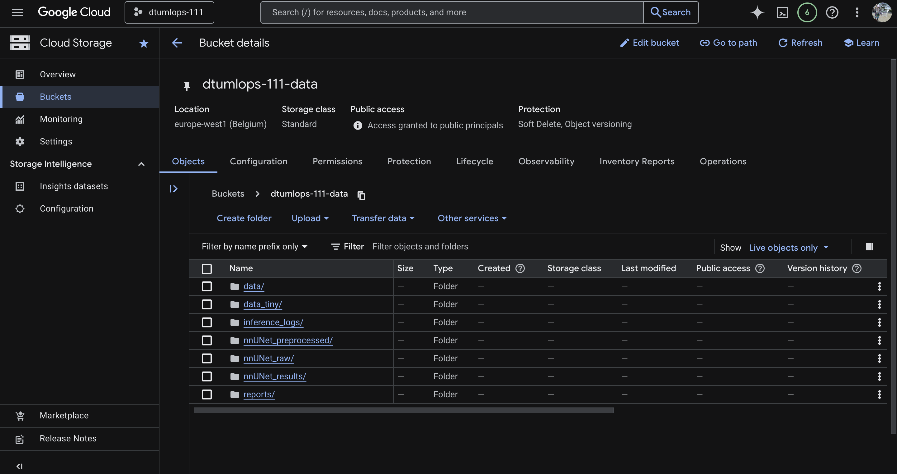
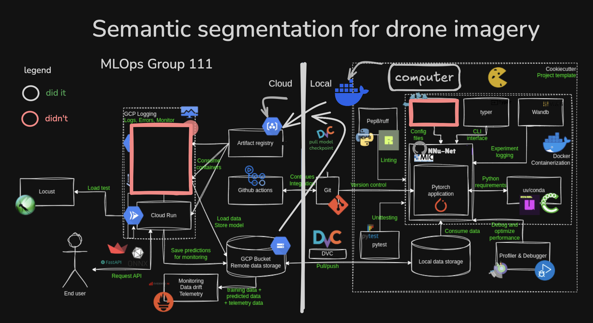

# Exam template for 02476 Machine Learning Operations

This is the report template for the exam. Please only remove the text formatted as with three dashes in front and behind
like:

`--- question 1 fill here ---`

Where you instead should add your answers. Any other changes may have unwanted consequences when your report is
auto-generated at the end of the course. For questions where you are asked to include images, start by adding the image
to the `figures` subfolder (please only use `.png`, `.jpg` or `.jpeg`) and then add the following code in your answer:

``

In addition to this markdown file, we also provide the `report.py` script that provides two utility functions:

Running:

```bash
python report.py html
```

Will generate a `.html` page of your report. After the deadline for answering this template, we will auto-scrape
everything in this `reports` folder and then use this utility to generate a `.html` page that will be your serve
as your final hand-in.

Running

```bash
python report.py check
```

Will check your answers in this template against the constraints listed for each question e.g. is your answer too
short, too long, or have you included an image when asked. For both functions to work you mustn't rename anything.
The script has two dependencies that can be installed with

```bash
pip install typer markdown
```

or

```bash
uv add typer markdown
```

## Overall project checklist

The checklist is _exhaustive_ which means that it includes everything that you could do on the project included in the
curriculum in this course. Therefore, we do not expect at all that you have checked all boxes at the end of the project.
The parenthesis at the end indicates what module the bullet point is related to. Please be honest in your answers, we
will check the repositories and the code to verify your answers.

### Week 1

* [x] Create a git repository (M5)
* [x] Make sure that all team members have write access to the GitHub repository (M5)
* [x] Create a dedicated environment for you project to keep track of your packages (M2)
* [x] Create the initial file structure using cookiecutter with an appropriate template (M6)
* [x] Fill out the `data.py` file such that it downloads whatever data you need and preprocesses it (if necessary) (M6)
* [x] Add a model to `model.py` and a training procedure to `train.py` and get that running (M6)
* [x] Remember to fill out the `requirements.txt` and `requirements_dev.txt` file with whatever dependencies that you
    are using (M2+M6)
* [x] Remember to comply with good coding practices (`pep8`) while doing the project (M7)
* [x] Do a bit of code typing and remember to document essential parts of your code (M7)
* [x] Setup version control for your data or part of your data (M8)
* [x] Add command line interfaces and project commands to your code where it makes sense (M9)
* [x] Construct one or multiple docker files for your code (M10)
* [x] Build the docker files locally and make sure they work as intended (M10)
* [ ] Write one or multiple configurations files for your experiments (M11)
* [ ] Used Hydra to load the configurations and manage your hyperparameters (M11)
* [x] Use profiling to optimize your code (M12)
* [x] Use logging to log important events in your code (M14)
* [x] Use Weights & Biases to log training progress and other important metrics/artifacts in your code (M14)
* [x] Consider running a hyperparameter optimization sweep (M14) - Not applicable
* [x] Use PyTorch-lightning (if applicable) to reduce the amount of boilerplate in your code (M15)

### Week 2

- [x] Write unit tests related to the data part of your code (M16)
- [ ] Write unit tests related to model construction and or model training (M16)
- [x] Calculate the code coverage (M16)
- [x] Get some continuous integration running on the GitHub repository (M17)
- [x] Add caching and multi-os/python/pytorch testing to your continuous integration (M17)
- [x] Add a linting step to your continuous integration (M17)
- [x] Add pre-commit hooks to your version control setup (M18)
- [ ] Add a continues workflow that triggers when data changes (M19)
- [ ] Add a continues workflow that triggers when changes to the model registry is made (M19)
- [x] Create a data storage in GCP Bucket for your data and link this with your data version control setup (M21)
- [ ] Create a trigger workflow for automatically building your docker images (M21)
- [ ] Get your model training in GCP using either the Engine or Vertex AI (M21)
- [x] Create a FastAPI application that can do inference using your model (M22)
- [x] Deploy your model in GCP using either Functions or Run as the backend (M23)
- [x] Write API tests for your application and setup continues integration for these (M24)
- [x] Load test your application (M24)
- [ ] Create a more specialized ML-deployment API using either ONNX or BentoML, or both (M25)
- [ ] Create a frontend for your API (M26)

### Week 3

* [x] Check how robust your model is towards data drifting (M27)
* [x] Deploy to the cloud a drift detection API (M27)
* [x] Instrument your API with a couple of system metrics (M28)
* [ ] Setup cloud monitoring of your instrumented application (M28)
* [x] Create one or more alert systems in GCP to alert you if your app is not behaving correctly (M28)
* [ ] If applicable, optimize the performance of your data loading using distributed data loading (M29)
* [x] If applicable, optimize the performance of your training pipeline by using distributed training (M30) - Not applicable
* [ ] Play around with quantization, compilation and pruning for you trained models to increase inference speed (M31)

### Extra

* [x] Write some documentation for your application (M32)
* [x] Publish the documentation to GitHub Pages (M32)
* [ ] Revisit your initial project description. Did the project turn out as you wanted?
* [ ] Create an architectural diagram over your MLOps pipeline
* [ ] Make sure all group members have an understanding about all parts of the project
* [x] Uploaded all your code to GitHub

## Group information

### Question 1

> **Enter the group number you signed up on <learn.inside.dtu.dk>**
>
> Answer:

111

### Question 2

> **Enter the study number for each member in the group**
>
> Example:
>
> _sXXXXXX, sXXXXXX, sXXXXXX_
>
> Answer:

s252699, s242508, s252749, s252618, s260015

### Question 3

> **A requirement to the project is that you include a third-party package not covered in the course. What framework**
> **did you choose to work with and did it help you complete the project?**
>
> Recommended answer length: 100-200 words.
>
> Example:
> _We used the third-party framework ... in our project. We used functionality ... and functionality ... from the_
> _package to do ... and ... in our project_.
>
> Answer:

We used the nnUNet package (https://github.com/MIC-DKFZ/nnUNet). This package definitely helped complete the project as it was our model and came with it's own training fucntionality, so we did not have to implement model.py and train.py scripts ourselves. Implementing our own model for our chosen task of segmenting drone images would have been very difficult and would have distracted us from the point of the project; to practice our mlops skills. Another third-party package we used was the kaggle api package, which helped us download our dataset (although we later stored the data in a google cloud bucket).

## Coding environment

> In the following section we are interested in learning more about you local development environment. This includes
> how you managed dependencies, the structure of your code and how you managed code quality.

### Question 4

> **Explain how you managed dependencies in your project? Explain the process a new team member would have to go**
> **through to get an exact copy of your environment.**
>
> Recommended answer length: 100-200 words
>
> Example:
> _We used ... for managing our dependencies. The list of dependencies was auto-generated using ... . To get a_
> _complete copy of our development environment, one would have to run the following commands_
>
> Answer:

We used the uv package manager for managing our python dependencies. Therefore, the list of dependencies was generated using uv. A new teammate would need to make sure they have python and uv installed. They could then run uv sync to create a virtual environment and install all of the necessary packages. Additionally, we provide step-by-step instructions in our ReadMe with commands for running each part of our code, as well as instructions for downloading the current data and current model version locally. We hope that this would make it easier for a new contributor to jump right and start coding.

### Question 5

> **We expect that you initialized your project using the cookiecutter template. Explain the overall structure of your**
> **code. What did you fill out? Did you deviate from the template in some way?**
>
> Recommended answer length: 100-200 words
>
> Example:
> _From the cookiecutter template we have filled out the ... , ... and ... folder. We have removed the ... folder_
> _because we did not use any ... in our project. We have added an ... folder that contains ... for running our_
> _experiments._
>
> Answer:

From the cookiecutter template, we have removed the models folder, because the nnUNet package we used saves models in a new folder called nnUNet_results. We also removed the configs and notebooks folders, as we did not get around to setting up configurations for our project and did not use any notebooks. Along with the nnUNet_results folder, we have added a nnUNet_preprocessed and nnUNet_raw folder. This is because the nnUNet package expects to take raw data from the nnUNet_raw folder and then placees it in the nnUNet_preprocessed folder after preprocessing. We also removed the .devcontainer folder as we did not end up using devcontainers.

### Question 6

> **Did you implement any rules for code quality and format? What about typing and documentation? Additionally,**
> **explain with your own words why these concepts matters in larger projects.**
>
> Recommended answer length: 100-200 words.
>
> Example:
> _We used ... for linting and ... for formatting. We also used ... for typing and ... for documentation. These_
> _concepts are important in larger projects because ... . For example, typing ..._
>
> Answer:

We used ruff for linting and formatting, configured as suggested in the module M7. We also used the mypy library for type checking. For documentation, we did not have any hard rules, but we tried to make sure that all important python functions and classes have docstrings. Throughout our codebase, we added comments where we (or LLMs) deemed them necessary.

## Version control

> In the following section we are interested in how version control was used in your project during development to
> corporate and increase the quality of your code.

### Question 7

> **How many tests did you implement and what are they testing in your code?**
>
> Recommended answer length: 50-100 words.
>
> Example:
> _In total we have implemented X tests. Primarily we are testing ... and ... as these the most critical parts of our_
> _application but also ... ._
>
> Answer:

We implemented unittests for the most important functions in our data.py script as well as our api.py script. The data script is crucial because they ensure that anyone using our package can succesfully prepare data for training. The api script is important because it delivers functionality to end users, and good testing can eliminate errors that are not related to the model itself. Notably, we did not implement unit tests for model.py or train.py, as these are mostly wrappers for the nnUNet package, which we deemed to be well-tested in its own right.

### Question 8

> **What is the total code coverage (in percentage) of your code? If your code had a code coverage of 100% (or close**
> **to), would you still trust it to be error free? Explain you reasoning.**
>
> Recommended answer length: 100-200 words.
>
> Example:
> *The total code coverage of code is X%, which includes all our source code. We are far from 100% coverage of our \*\*
> *code and even if we were then...\*
>
> Answer:

Our code coverage is only 43%, so we are a really far ways from 100%. Again part of this relates to the fact that we do not have a lot of testing for our model.py and train.py, as explained in Question 7. Potentially bad practice, and if we had no time constraints, we probably would have liked to implement our own testing to make sure the model is working exactly as expected. Our coverage also lists only 38% coverage for data.py, which we are confused about since every function has a unit test and only a few lines of code are listed as not covered in the coverage report.

### Question 9

> **Did you workflow include using branches and pull requests? If yes, explain how. If not, explain how branches and**
> **pull request can help improve version control.**
>
> Recommended answer length: 100-200 words.
>
> Example:
> _We made use of both branches and PRs in our project. In our group, each member had an branch that they worked on in_
> _addition to the main branch. To merge code we ..._
>
> Answer:

We used both branches and PRs in our project. For most of the items on the project checklist, a member of the team was able to tackle the item in isolation on their own branch, and then pull it back into main when done. This system helped us effectively divide up work and ressolve merge conflicts more easily without accidentally overriding each other's work or deleting important code. Using PRs also helped us quality check our code, since we could run automated linting and test checks on Github before allowing a PR to merge into main. For a longer project, we would also consider adding code reviews (automated and/or human) to our merge process. Below some branch examples:

- `docs/update-readme` branch for updating our readme as the project developed
- `feature/cloud-setup` for the inclusion of code and config files related to our GC project, e.g. `.dvc` files.
- `feature/api-deployment` for tasks releted to setting up an inference API and running it on the cloud
- `bugfix/<x>` for minor issues found in the main branch

### Question 10

> **Did you use DVC for managing data in your project? If yes, then how did it improve your project to have version**
> **control of your data. If no, explain a case where it would be beneficial to have version control of your data.**
>
> Recommended answer length: 100-200 words.
>
> Example:
> _We did make use of DVC in the following way: ... . In the end it helped us in ... for controlling ... part of our_
> _pipeline_
>
> Answer:

We did make use of DVC + gcloud buckets. While the training data did not undergo any significant changes that required version control capabilites, using dvc was most helpful when considering model checkpoints. This was true for tue reasons. Firstly, nnU-Net is a complex model and training it on our segmentation task wasn't easy. It was therefore extremely valuable to easily store and update our best model. Secondly, several features depended on having a workable model. `dvc` was our main tool to share model checkpoints across members as well as to load the model in the cloud.

### Question 11

> **Discuss you continuous integration setup. What kind of continuous integration are you running (unittesting,**
> **linting, etc.)? Do you test multiple operating systems, Python version etc. Do you make use of caching? Feel free**
> **to insert a link to one of your GitHub actions workflow.**
>
> Recommended answer length: 200-300 words.
>
> Example:
> _We have organized our continuous integration into 3 separate files: one for doing ..., one for running ... testing_
> _and one for running ... . In particular for our ..., we used ... .An example of a triggered workflow can be seen_
> _here: <weblink>_
>
> Answer:

Our continuous integration setup serves three main functions that together help ensure code quality in the development process. We use a tests.yaml workflow that automatically runs all unit tests located in our tests/ directory. These tests are executed across the three main operating systems; Ubuntu, Windows, and macOS.  This could help us catch platform-specific issues early and ensures that our code behaves consistently in different environments. This workflow is triggered on every pull request, so that immediate feedback is provided to contributors before faulty code can be merged. An example of a successful test run can be seen here: https://github.com/ecenazelverdi/DTU_MLOps_111/actions/runs/21267761386.  We also have a dedicated linting workflow defined in linting.yaml. This action is also triggered on pull requests and is responsible for enforcing consistent code style and identifying potential formatting or static analysis issues.  By running linting checks automatically, we reduce technical debt and improve code readability across the project. An example linting run can be found here: https://github.com/ecenazelverdi/DTU_MLOps_111/actions/runs/21255981434.  Finally, we attempted to set up an additional CI workflow using a cloudbuild.yaml file to build a Docker image for our API and deploy it to the cloud.  While this would have enabled automated build and deployment, we encountered configuration errors and were unfortunately unable to get this pipeline fully operational within the available timeframe of the project.

## Running code and tracking experiments

> In the following section we are interested in learning more about the experimental setup for running your code and
> especially the reproducibility of your experiments.

### Question 12

> **How did you configure experiments? Did you make use of config files? Explain with coding examples of how you would**
> **run a experiment.**
>
> Recommended answer length: 50-100 words.
>
> Example:
> _We used a simple argparser, that worked in the following way: Python my_script.py --lr 1e-3 --batch_size 25_
>
> Answer:

We did not use separate config files for experiments. Instead, we relied on nnUNet's default configurations and created a custom trainer class to modify training parameters (e.g., reducing epochs to 5). Experiments were run using invoke tasks through Docker containers. To run training: `uv run invoke docker-build` to build images, then `uv run invoke docker-train` to start training. For inference: `uv run invoke docker-inference`. All configurations are embedded in the dockerfiles and entrypoint scripts with volume mounts for data persistence. 

### Question 13

> **Reproducibility of experiments are important. Related to the last question, how did you secure that no information**
> **is lost when running experiments and that your experiments are reproducible?**
>
> Recommended answer length: 100-200 words.
>
> Example:
> _We made use of config files. Whenever an experiment is run the following happens: ... . To reproduce an experiment_
> _one would have to do ..._
>
> Answer:

We ensured reproducibility through multiple mechanisms. Docker containers guarantee consistent environments across different machines. DVC tracks both data and model checkpoints, allowing anyone to pull the exact dataset and model versions used in experiments. Weights & Biases logs all training metrics, hyperparameters, and artifacts automatically during training runs. Volume mounts (`-v $(pwd)/nnUNet_results:/app/nnUNet_results`) persist training outputs to the host machine, preventing data loss when containers stop. For sensitive credentials (WANDB_API_KEY, KAGGLE credentials), we use a `.env` file that each user creates individually following our documentation template - this maintains security while ensuring reproducibility. To reproduce an experiment: clone the repo, run `dvc pull` to get data/models, create a personal `.env` file with API keys, build Docker images with `uv run invoke docker-build`, and run training with `uv run invoke docker-train`. All results are automatically saved locally and logged to W&B.

### Question 14

> **Upload 1 to 3 screenshots that show the experiments that you have done in W&B (or another experiment tracking**
> **service of your choice). This may include loss graphs, logged images, hyperparameter sweeps etc. You can take**
> **inspiration from [this figure](figures/wandb.png). Explain what metrics you are tracking and why they are**
> **important.**
>
> Recommended answer length: 200-300 words + 1 to 3 screenshots.
>
> Example:
> _As seen in the first image when have tracked ... and ... which both inform us about ... in our experiments._
> _As seen in the second image we are also tracking ... and ..._
>
> Answer:


We tracked our training experiments using Weights & Biases, logging both quantitative metrics and qualitative visualization results. As seen in the first image, we monitored the combined Dice-CE (Dice + Cross Entropy) loss during training. nnUNet uses this hybrid loss function that combines Dice loss for segmentation overlap quality with Cross Entropy loss for pixel-wise classification accuracy. The loss values decrease over epochs (including negative values in some cases), indicating the model is learning effectively to minimize prediction errors. Lower loss values indicate better segmentation performance, with the model converging toward optimal predictions. This metric is crucial because it directly reflects how well the model is learning to segment drone images into different classes.

In the second image, we tracked visualization results showing the model's actual segmentation outputs on validation images during training. These visual samples are essential for qualitatively assessing model performance beyond numerical metrics. By logging segmentation masks overlaid on input images, we can identify if the model is correctly identifying object boundaries, handling edge cases, and generalizing well to unseen data. This visual tracking helped us catch issues like undersegmentation or class confusion that pure numerical metrics might miss. Together, these metrics provided comprehensive monitoring of both the learning process (via loss curves) and actual output quality (via visualizations), ensuring our model was training correctly and producing useful segmentations for our drone imagery task.

### Question 15

> **Docker is an important tool for creating containerized applications. Explain how you used docker in your**
> **experiments/project? Include how you would run your docker images and include a link to one of your docker files.**
>
> Recommended answer length: 100-200 words.
>
> Example:
> _For our project we developed several images: one for training, inference and deployment. For example to run the_
> _training docker image: `docker run trainer:latest lr=1e-3 batch_size=64`. Link to docker file: <weblink>_
>
> Answer:

For our project we developed several images for different purposes: training, inference, API deployment, and BentoML service. To run the training we succesfully built images and ran corresponding containers locally in machines with gpus, but failed to reproduce it in our mac and cloud environments.

- training docker image: `docker run train:latest` or `uv run invoke docker-train`. Link to docker file: <https://github.com/ecenazelverdi/DTU_MLOps_111/blob/main/train.dockerfile>
- inference docker image: `docker run inference:latest` or `uv run invoke docker-inference`. Link to docker file: <https://github.com/ecenazelverdi/DTU_MLOps_111/blob/main/inference.dockerfile>
- api docker image: `docker run -p 8080:8080 api:latest` or `uv run invoke docker-run-api`. Link to docker file: <https://github.com/ecenazelverdi/DTU_MLOps_111/blob/main/api.dockerfile>
- bentoml docker image: `docker run -p 8080:8080 bento:latest` or `uv run invoke docker-run-bento`. Link to docker file: <https://github.com/ecenazelverdi/DTU_MLOps_111/blob/main/bento.dockerfile>
### Question 16

> **When running into bugs while trying to run your experiments, how did you perform debugging? Additionally, did you**
> **try to profile your code or do you think it is already perfect?**
>
> Recommended answer length: 100-200 words.
>
> Example:
> _Debugging method was dependent on group member. Some just used ... and others used ... . We did a single profiling_
> _run of our main code at some point that showed ..._
>
> Answer:

Debugging method was mostly dependent on the tool at hand. For regular Python debugging, we used a mix of IDE debuggers, print statements, and your good old copilot help; however, the inclusion of additional tools meant we also got more creative with identifying and solving bugs. For example, solving issues when running train images on macs involved using Docker Desktop Stats for identifying resource constraints in containers.

## Working in the cloud

> In the following section we would like to know more about your experience when developing in the cloud.

### Question 17

> **List all the GCP services that you made use of in your project and shortly explain what each service does?**
>
> Recommended answer length: 50-200 words.
>
> Example:
> _We used the following two services: Engine and Bucket. Engine is used for... and Bucket is used for..._
>
> Answer:

We used the following two services: Bucket, and Cloud Run. Bucket is used for storing and versioning both training data (in its various stages) as well as model checkpoints. Cloud Run is used for hosting and running our inference API on the cloud.

Furthermore, we used Google Container Registry to store our docker images for the API. We used Google Cloud Build to automatically build these images in the cloud. Finally, we made use of Google Cloud Logging to monitor and debug our application running on Cloud Run.

### Question 18

> **The backbone of GCP is the Compute engine. Explained how you made use of this service and what type of VMs**
> **you used?**
>
> Recommended answer length: 100-200 words.
>
> Example:
> _We used the compute engine to run our ... . We used instances with the following hardware: ... and we started the_
> _using a custom container: ..._
>
> Answer:

We mostly did not use GCP's Compute Engine. While initially we were hoping to train our model on the cloud, issues with gaining GPU access and running training on CPUs coupled with successful training runs on local GPUs steered us off this path.

For our initial experiments, we used `e2-medium (2 vCPUs, 4 GB Memory)` machines with `10 GB` and then scaled up to a `n2d-standard-8 (8 vCPUs, 32 GB Memory)` machine with `120 GB` of memory; however, each training epoch was taking approximately 1h 30 on this machine, so the training here was simply not viable.

### Question 19

> **Insert 1-2 images of your GCP bucket, such that we can see what data you have stored in it.**
> **You can take inspiration from [this figure](figures/bucket.png).**
>
> Answer:



### Question 20

> **Upload 1-2 images of your GCP artifact registry, such that we can see the different docker images that you have**
> **stored. You can take inspiration from [this figure](figures/registry.png).**
>
> Answer:


### Question 21

> **Upload 1-2 images of your GCP cloud build history, so we can see the history of the images that have been build in**
> **your project. You can take inspiration from [this figure](figures/build.png).**
>
> Answer:


### Question 22

> **Did you manage to train your model in the cloud using either the Engine or Vertex AI? If yes, explain how you did**
> **it. If not, describe why.**
>
> Recommended answer length: 100-200 words.
>
> Example:
> _We managed to train our model in the cloud using the Engine. We did this by ... . The reason we choose the Engine_
> _was because ..._
>
> Answer:

We did not. We couldn't get GPU access and we had a more convenient option in some our team's computers. We therefore prioritized the rest of the MLOps pipeline over re-training a model on the cloud, since our model checkpoint after 78 epochs was already quite good at the segmentation task at hand.

Instead, we trained locally using Docker containers on a team member's machine equipped with a dedicated GPU. Since our model checkpoint (after 78 epochs) was already performing well on the segmentation task, this approach proved significantly faster and allowed us to efficiently complete our training runs while still adhering to containerization best practices.

## Deployment

### Question 23

> **Did you manage to write an API for your model? If yes, explain how you did it and if you did anything special. If**
> **not, explain how you would do it.**
>
> Recommended answer length: 100-200 words.
>
> Example:
> _We did manage to write an API for our model. We used FastAPI to do this. We did this by ... . We also added ..._
> _to the API to make it more ..._
>
> Answer:
We successfully implemented an API using the **FastAPI** framework. It serves our trained nnU-Net model via endpoints such as `/predict/` for single images and `/batch_predict/` for handling multiple files at once. We also implemented a `/drift/` endpoint that triggers a data drift report generation and uploads it to the cloud.

We implemented several features to make the API robust for production:
1.  **Monitoring:** We integrated Prometheus metrics (request counters, latency histograms) exposed at `/metrics` to monitor API performance.
2.  **Background Tasks:** We used FastAPI's `BackgroundTasks` to asynchronously log inference statistics to a Google Cloud Storage bucket without blocking the response.
3.  **BentoML Service:** In addition to pure FastAPI, we also experimented with a **BentoML** service (`drone-seg-service`) which supports DVC model pulling on startup and base64 input handling.
4.  **DVC Integration:** Our API container is designed to check for and pull the latest model version from DVC on startup (via an entrypoint script or code), ensuring that we always serve the correct model version in the cloud.

### Question 24

> **Did you manage to deploy your API, either in locally or cloud? If not, describe why. If yes, describe how and**
> **preferably how you invoke your deployed service?**
>
> Recommended answer length: 100-200 words.
>
> Example:
> _For deployment we wrapped our model into application using ... . We first tried locally serving the model, which_
> _worked. Afterwards we deployed it in the cloud, using ... . To invoke the service an user would call_
> _`curl -X POST -F "file=@file.json"<weburl>`_
>
> Answer:

Yes. We wrapped our model into an application using fastAPI, then installed the `dtu_mlops_111`. and then ran it locally with

```
uv run invoke app
```

The live API can be found here [https://model-api-32512441443.europe-west1.run.app](https://model-api-32512441443.europe-west1.run.app)

By default the API performs a health check. To perform inference on an image, run

```bash
curl --location 'https://model-api-32512441443.europe-west1.run.app/predict/' \
--form 'data=@"<YOUR_PATH_TO_IMAGE>/<IMAGE_NAME>.png"' \
```

In addition, we created a more specialized deployment using BentoML. The BentoML service was containerized with Docker and deployed to Google Cloud Run, where it downloads the trained nnU-Net checkpoint via DVC at startup. The BentoML endpoint accepts Base64-encoded images in JSON format:

```bash
curl -X POST "https://drone-seg-32512441443.europe-north1.run.app/predict_base64" \
  -H "Content-Type: application/json" \
  --data-binary @payload.json
```

This setup provides a production-ready inference API with reproducible model artifact management.

### Question 25

> **Did you perform any unit testing and load testing of your API? If yes, explain how you did it and what results for**
> **the load testing did you get. If not, explain how you would do it.**
>
> Recommended answer length: 100-200 words.
>
> Example:
> _For unit testing we used ... and for load testing we used ... . The results of the load testing showed that ..._
> _before the service crashed._
>
> Answer:

Yes, we load tested our API using locust.  To do this, we implemented a very simple locustfile.py that accesses the API get, predict, and predict_batch endpoints.  It also creates a few random images to use for said prediction requests.  Our API is very slow and we were able to crash it easily.  The error message we discovered on google cloud run implied that our API container was building too slowly.  Because of this, we learned that it is probably not a good idea to have run a dvc pull of the model weights during each api container build.  Our API also has some unit testing in the tests/integrationtests folder.

### Question 26

> **Did you manage to implement monitoring of your deployed model? If yes, explain how it works. If not, explain how**
> **monitoring would help the longevity of your application.**
>
> Recommended answer length: 100-200 words.
>
> Example:
> _We did not manage to implement monitoring. We would like to have monitoring implemented such that over time we could_
> _measure ... and ... that would inform us about this ... behaviour of our application._
>
> Answer:

We implemented monitoring of our deployed model using api monitoring from the locust framework.  Our locustfile.py aims to simulate simple but realistic user behavior by repeatedly sending requests to the root, /predict/, and /batch_predict/ endpoints with rnadomly generated image data.  We can use locust to monitor success rates, response times, and failure conditions.  We also have application monitoring implemented directly into our api.py script with the prometheus framework.  There, we expose metrics such as request counts and latency histograms.  Finally, we have set up some simple alerts on our google cloud platform which send emails to teammates for certain events such as higher than expected api requests.

## Overall discussion of project

> In the following section we would like you to think about the general structure of your project.

### Question 27

> **How many credits did you end up using during the project and what service was most expensive? In general what do**
> **you think about working in the cloud?**
>
> Recommended answer length: 100-200 words.
>
> Example:
> _Group member 1 used ..., Group member 2 used ..., in total ... credits was spend during development. The service_
> _costing the most was ... due to ... . Working in the cloud was ..._
>
> Answer:

In total, we used approximately **$52.30 credits**. The most expensive service was **Compute Engine** ($49.40), accounting for ~95% of our total budget. This was primarily due to the extensive model training that required running a high-performance VM for approximately 1000 epochs.

Other costs included **Cloud Run** ($1.51) for hosting our Inference API, **Cloud Storage** ($0.60) for storing our data and model checkpoints, and minor costs for networking and VM management. Interestingly, Cloud Build and Logging remained within the free tier limits ($0.00).

In general, working in the cloud was highly beneficial as it allowed us to access powerful compute resources that were not available locally. However, the high cost of the VM reminds us that "turning off resources when not in use" is a critical habit in cloud engineering.

### Question 28

> **Did you implement anything extra in your project that is not covered by other questions? Maybe you implemented**
> **a frontend for your API, use extra version control features, a drift detection service, a kubernetes cluster etc.**
> **If yes, explain what you did and why.**
>
> Recommended answer length: 0-200 words.
>
> Example:
> _We implemented a frontend for our API. We did this because we wanted to show the user ... . The frontend was_
> _implemented using ..._
>
> Answer:

Yes, we implemented two major extra features:
1.  **Data Drift Detection:** We implemented a drift detection service using the `evidently` library. We exposed a specific endpoint `/drift/` in our API that compares the inference data distribution against our training data and generates an HTML report. This report is then automatically uploaded to Google Cloud Storage for persistent access.
2.  **Project Documentation:** We used **MkDocs** to generate a static documentation site for our project. We configured it to automatically build documentation from our docstrings and markdown files, and set up a GitHub Action (or task) to deploy it to GitHub Pages, ensuring our project documentation is always up-to-date and accessible.

### Question 29

> **Include a figure that describes the overall architecture of your system and what services that you make use of.**
> **You can take inspiration from [this figure](figures/overview.png). Additionally, in your own words, explain the**
> **overall steps in figure.**
>
> Recommended answer length: 200-400 words
>
> Example:
>
> _The starting point of the diagram is our local setup, where we integrated ... and ... and ... into our code._
> _Whenever we commit code and push to GitHub, it auto triggers ... and ... . From there the diagram shows ..._
>
> Answer:



The diagram is heavily inspired by the [MLOps Course summary](https://skaftenicki.github.io/dtu_mlops/pages/overview/), for the very reason of using much of the same tools. We now describe the diagram in full, but you can **skip the next two paragraphs** if already familiar with the original course summary.

Our overall architecture can safely be divided in what occurs locally (right) and on the cloud (left). Locally, we used the default `cookiecutter` template from this course, with deviations stated previously. the heart of system is a `pytorch` model. It is trained on approximately 3GBs of data stored locally and uses `*uv` as the de-facto package manager. `Typer` is used as a CLI basis, mainly for preprocessing commands; `Wandb` is our experiment manager, `pytest` is used for unit testing, `git` for version control, and `ruff` for formatting. The training application, which consists mainly of commands, is containerized for gpu use using `docker`. the Inference application is wrapped as an API and served in a docker image as well.

On to the cloud. The repository is stored on `Github` and Pull Requests are tested automatically through an `Actions` workflow. the API's docker images are pushed manually to our `Artifact Registry`, which is then used by `Cloud Run` to host our not-so-fast fastAPI. We use `Locust` for stress testing and set up **data drift monitoring on the cloud**.

Now in terms of the differences from the standard model. We chose `NNU-Net` as our main external dependency, which uses Pytorch as a basis for a very powerful segmentation model. Training was not not on the cloud, but rather run on a container locally in a machine with a GPU. For inference, we relied on manual image builds, which were then pushed to the artifact registry. the API relies on having a model checkpoint available, and this is achieved by running `dvc pull <model_dir_name>.dvc` on running the image.

### Question 30

> **Discuss the overall struggles of the project. Where did you spend most time and what did you do to overcome these**
> **challenges?**
>
> Recommended answer length: 200-400 words.
>
> Example:
> _The biggest challenges in the project was using ... tool to do ... . The reason for this was ..._
>
> Answer:

One of our biggest struggles with the project was training our model.  It seems that Google is not offering access to any GPUs at the moment on their cloud platform.  We did have one group member with a GPU, but we really struggled setting up a dockerfile that builds and runs training successfully.  Because of our struggles with dockerfiles, we also struggled to automate our deployment and cloud build process.  Currently, we do not have any github actions that successfully automatically deploy the model.

- TODO We also struggled with:

- Editing `data.py` so that it outputs the right format for training
- Containerizing training application
- Running training effectively

### Question 31

> **State the individual contributions of each team member. This is required information from DTU, because we need to**
> **make sure all members contributed actively to the project. Additionally, state if/how you have used generative AI**
> **tools in your project.**
>
> Recommended answer length: 50-300 words.
>
> Example:
> _Student sXXXXXX was in charge of developing of setting up the initial cookie cutter project and developing of the_
> _docker containers for training our applications._
> _Student sXXXXXX was in charge of training our models in the cloud and deploying them afterwards._
> _All members contributed to code by..._
> _We have used ChatGPT to help debug our code. Additionally, we used GitHub Copilot to help write some of our code._
> Answer:

Akin Mert Gümüs (s242508) was responsible for containerizing training and inference applications using Docker, implementing logging throughout the codebase, and integrating Weights & Biases for experiment tracking and model visualization.

Bruno Zorrilla Medina Luna (s260015). Most-things Cloud: Google Cloud general setup, `dvc` and cloud bucket integration, and cloud training containerization (failed).

Ecenaz Elverdi (s252699) Developed the core FastAPI application and managed its deployment on Google Cloud Run. Additionally implemented data drift detection (Evidently), project documentation (MkDocs), initial git/project structure, and API testing/CI pipelines for FastAPI's endpoints.

Elif Pulukcu (s252749) Implemented dataset preparation/export for nnU-Net training (mask conversion + split + metadata) and developed a BentoML inference service runnable locally and via Docker/Cloud Run.

Kerick Jon Walker (s252618) was in charge of implementing testing (unit testing, load testing), setting up continuous integration including running tests and linting, pre-commit, and setting up monitoring of the API.

### Use of Generative AI Tools (AI Declaration)
We have all used various LLMs incluidng Github Copilot, Google Gemini, ChatGPT, and others in debugging our code and writing some of it.

